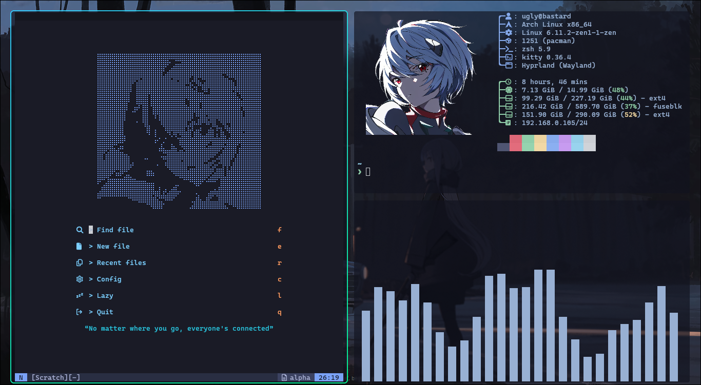
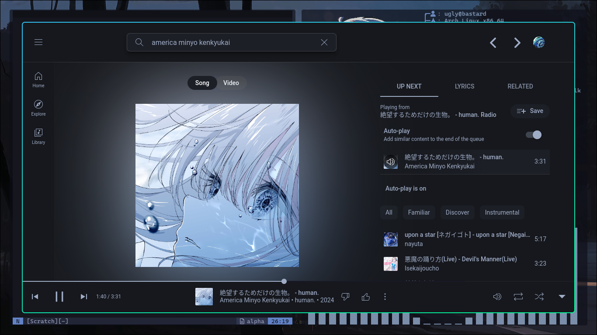
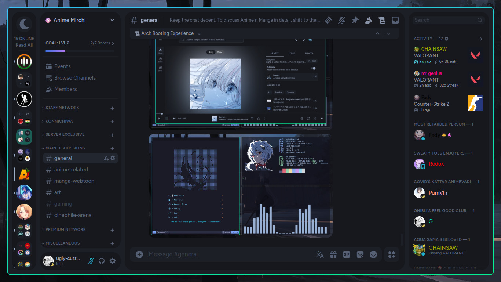
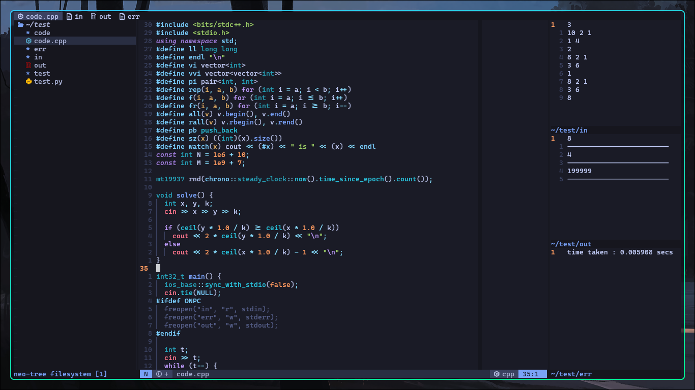
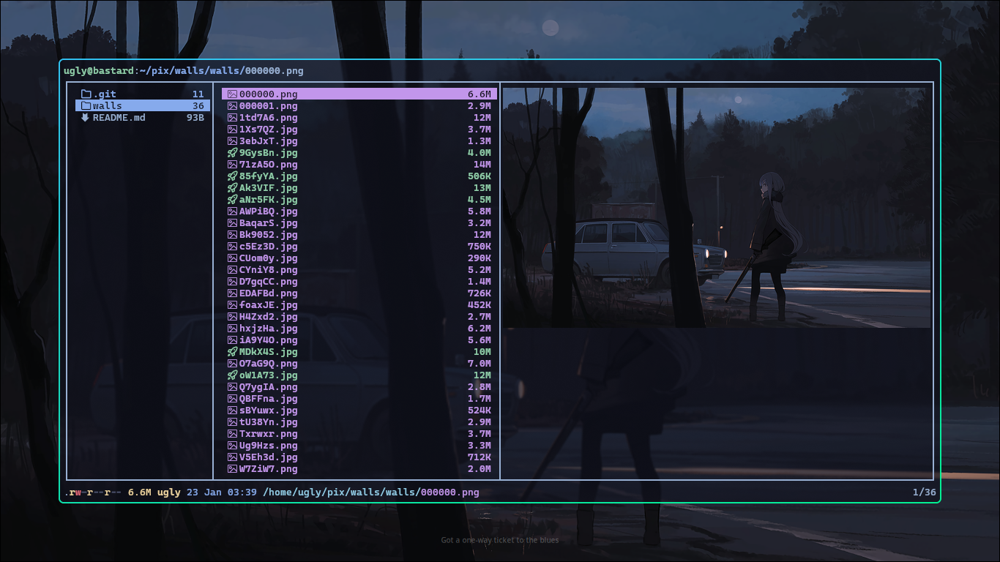
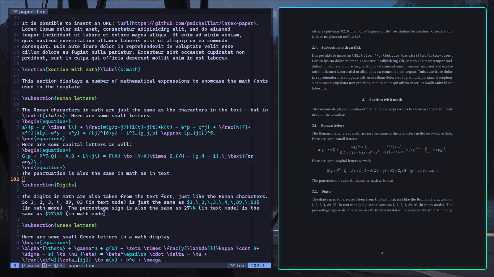
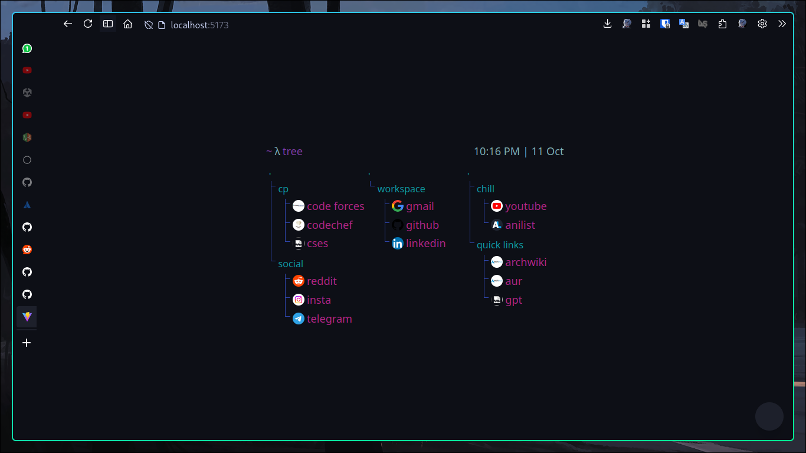

# Dots

My personal config files for various tools and apps I use.<br>
My nvim configuration can be found at [ugly-custard/nvim](https://github.com/ugly-custard/nvim) and my wallpapers at [ugly-custard/walls](https://github.com/ugly-custard/walls)

## Looks









## Whats in the images above?

1. nvim, fastfetch, cava
2. [th-ch/youtube-music](https://github.com/th-ch/youtube-music) with custom midnight-theme
3. vesktop with [midnight theme](https://raw.githubusercontent.com/refact0r/midnight-discord/master/midnight.theme.css)
4. nvim with some buffers open
5. lf file manager with image and pdf preview
6. nvim with vimtex and zathura for preview
7. barebones custom firefox startpage (forever work in progress)

## How to use

The dotfiles are tracked using the git bare repo method following [this tutorial on atlassian](https://www.atlassian.com/git/tutorials/dotfiles).

```sh
## I have not yet tested copying my dotfiles from one system to another
## gotta test these in a VM before using on a new machine
git clone --bare https://github.com/ugly-custard/dots.git $HOME/.dots

function dots {
   git --git-dir=$HOME/.dots/ --work-tree=$HOME $@
}

mkdir -p .dots-backup
dots checkout

if [ $? = 0 ]; then
  echo "Checked out dots.";
  else
    echo "Backing up pre-existing dot files.";
    dots checkout 2>&1 | egrep "\s+\." | awk {'print $1'} | xargs -I{} mv {} .dots-backup/{}
fi;

dots checkout
dots config status.showUntrackedFiles no
```

##
The teto.png speaks to my soul, please have a look and enjoy. Thank you.